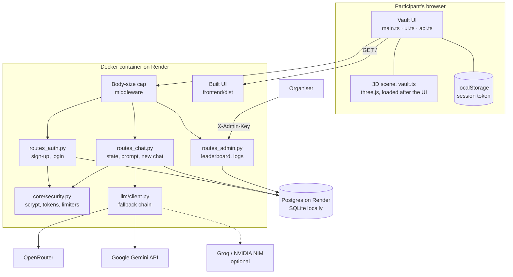
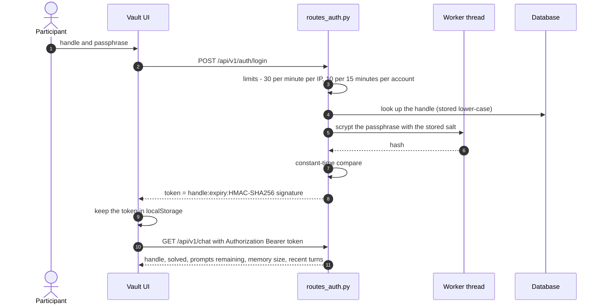
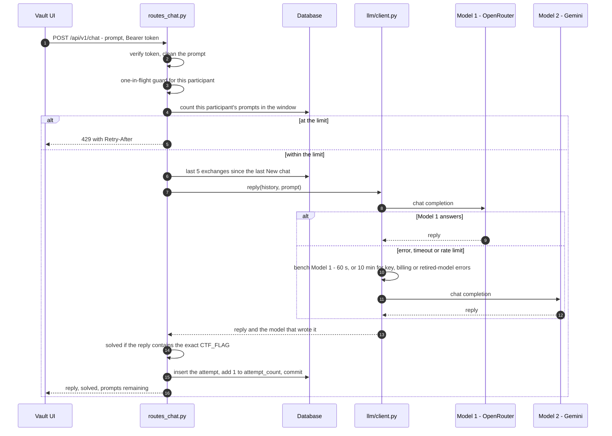
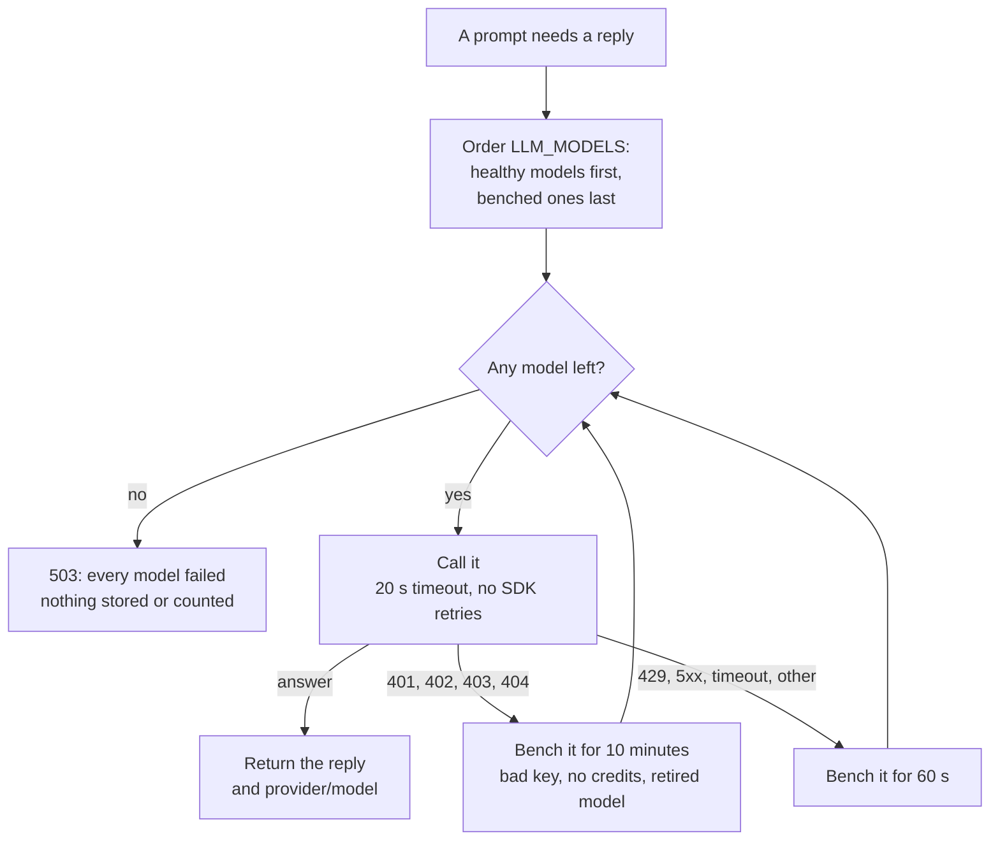
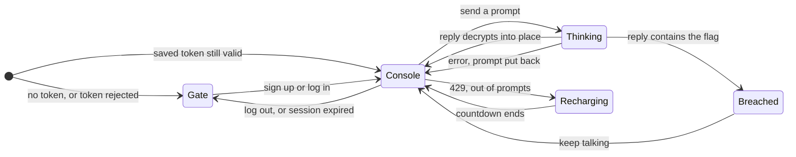
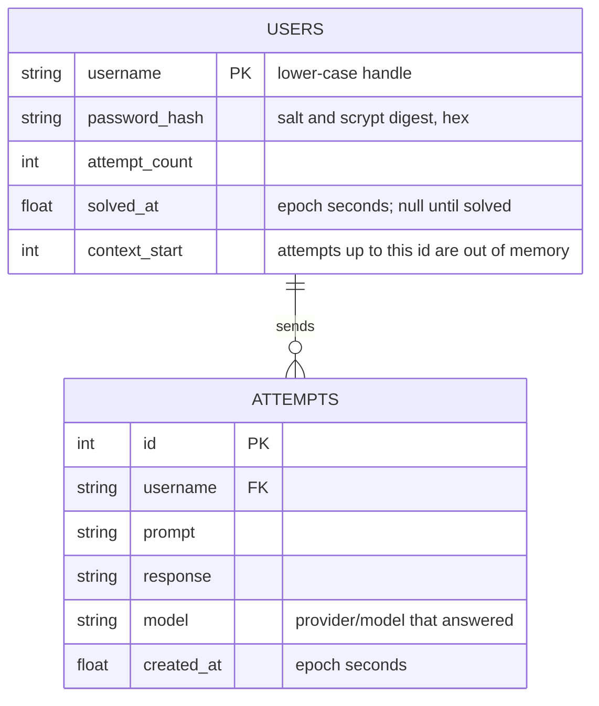

# Vault Keeper — Architecture & Engineering Notes

How the LLM Sandbox CTF works inside: the data flow and request lifecycles, access control, rate limiting, security, how edge cases are handled, and the problems found while building it, with the fix for each. For setup, deployment and the API reference, see the [README](README.md).

## Contents

1. [What the system does](#1-what-the-system-does)
2. [Tech stack](#2-tech-stack)
3. [System overview](#3-system-overview)
4. [How a request flows](#4-how-a-request-flows)
5. [Data model and data flow](#5-data-model-and-data-flow)
6. [Access control](#6-access-control)
7. [Rate limiting](#7-rate-limiting)
8. [Security](#8-security)
9. [Edge cases](#9-edge-cases)
10. [Problems encountered and how they were mitigated](#10-problems-encountered-and-how-they-were-mitigated)
11. [Testing and verification](#11-testing-and-verification)
12. [Known limitations](#12-known-limitations)

---

## 1. What the system does

Participants chat with the **Vault Keeper**, an LLM whose system prompt contains a secret flag and rules against revealing it. The challenge is to talk it out of the vault with prompt injection. One documented bypass exists, so the puzzle is solvable within an event (see README §4.2).

The platform around the model:

- **Accounts:** each participant signs up with a handle and passphrase, and gets a private conversation.
- **Isolation:** each participant has their own context window (the Keeper's memory), their own rate limit and their own solve status.
- **Resilience:** replies come from an ordered fallback chain of LLMs from different providers, each verified against the challenge.
- **Organiser tools:** a leaderboard and a full log of every exchange, including which model answered.
- **Interface:** a 3D Keeper (three.js) that shows what the model is doing, with replies that "decrypt" into place (anime.js).

---

## 2. Tech stack

| Layer | Choice | Version | Why |
|---|---|---|---|
| Backend language | Python | 3.14 (Docker image) | Async I/O and a mature ecosystem for web and LLM work |
| Web framework | FastAPI on Starlette | 0.142 / 1.7 | Async request handling, Pydantic validation, OpenAPI docs at `/docs` |
| Server | Uvicorn, one worker | 0.54 | The workload is waiting on LLMs; one async worker holds hundreds of open requests |
| Configuration | pydantic-settings | 2.15 | Reads the environment and `.env`, and refuses unsafe values at startup |
| Database access | SQLAlchemy async | 2.1 | One code path for Postgres in production and SQLite locally |
| Database drivers | asyncpg / aiosqlite | 0.31 / 0.22 | Postgres on Render, SQLite for local runs and tests |
| LLM client | OpenAI Python SDK | 3.24 | OpenRouter, the Gemini API, Groq and NVIDIA NIM all speak the OpenAI API |
| Passwords and tokens | Python standard library (`hashlib.scrypt`, `hmac`) | — | Memory-hard hashing and signed tokens with no extra dependency |
| Frontend | TypeScript, Vite | 5 / 8 | Typed DOM code; small, code-split production bundles |
| 3D | three.js with bloom post-processing | r186 | The orb, rings and particles, rendered in WebGL |
| Motion | anime.js | 4.5 | UI transitions, the `scrambleText` decrypt effect, and tweening the 3D scene's state |
| Container | Docker, multi-stage | `node:24-alpine` → `python:3.14-slim` | Builds the UI, then ships a slim runtime image as a non-root user |
| Hosting | Render Blueprint: web service + Postgres | — | One file (`render.yaml`) describes the whole deployment |
| Tests | pytest with Starlette's TestClient | 9.1 | API flows with a fake model; opt-in live checks against real models |

---

## 3. System overview



**Code map**

| Path | Responsibility |
|---|---|
| `app/main.py` | App assembly: routers under `/api/v1`, the 10 KB body cap, `/health`, the built UI mounted at `/` |
| `app/core/config.py` | Every setting, validated at startup |
| `app/core/security.py` | scrypt hashing, token signing and checking, the admin-key check, client-IP detection, the sliding-window limiter |
| `app/api/routes_auth.py` | Sign-up and login |
| `app/api/routes_chat.py` | Token → user, the rate limit, the context window, flag detection, persistence |
| `app/api/routes_admin.py` | Leaderboard and logs |
| `app/llm/client.py` | Provider table, the fallback chain, benching |
| `app/llm/system_prompt.py` | The Keeper's rules; the flag comes in from settings |
| `app/db/` | Engine, session dependency, the two tables |
| `frontend/src/` | `main.ts` session flow · `api.ts` HTTP · `ui.ts` DOM and motion · `vault.ts` 3D scene · `participant.ts` token storage |

The UI is served by the same FastAPI app as the API. One origin means no CORS configuration and no cookies, so there is no CSRF surface.

---

## 4. How a request flows

### 4.1 Sign-up and login



Sign-up is the same, except it hashes a new passphrase with a fresh 16-byte salt and inserts the row. A duplicate handle hits the primary key and returns `409`, which also settles two simultaneous sign-ups for the same name.

### 4.2 Sending a prompt



If every model fails, the API returns `503` and stores nothing. The attempt isn't counted against the limit, and the UI puts the prompt back in the input box.

### 4.3 The model fallback chain



- Benching is what makes the fallback fast. Without it, every request during an outage would first wait 20 s on the broken provider before trying the next one.
- Benched models stay in the list as a last resort, so the chain never gives up without trying everything.
- `max_tokens` is 2048. Some models think silently before answering, and that hidden reasoning counts against the cap (see §10.2).

### 4.4 The Keeper's memory (context window)

Each participant's conversation is the list of their attempts in the database. The model sees only the latest five exchanges after the participant's `context_start` marker:

```
attempts for team-rocket:   #3  #7  #9  #12  #15  #18  #21  #22
                                     ▲
New chat set context_start = 9 ──────┘
the Keeper sees (last 5 after #9):        #12  #15  #18  #21  #22   + the new prompt
```

- **New chat** (`DELETE /api/v1/chat`) moves `context_start` to the participant's latest attempt. Nothing is deleted; the organiser logs still show every exchange.
- The UI shows the whole conversation since the last New chat, and dims turns that have scrolled out of the Keeper's memory. In a prompt-injection CTF that matters: participants can see exactly what the model still remembers.
- Isolation is structural. The history query filters on the authenticated handle, so another participant's messages can never enter a context.

### 4.5 The frontend



- **Fast first load.** The UI bundle is about 19 KB gzipped and usable at once. three.js and the scene, about 141 KB gzipped, load afterwards, and scene calls are no-ops until it arrives.
- **The scene mirrors the model.**
  - The eye follows the pointer and the orb ripples with each keystroke.
  - Rings spin up and the colours shift while a reply is pending, and the scene flashes red on errors.
  - On a solve, the bolts retract and the vault opens.
  - Dragging empty space turns the vault dial; clicking the orb pokes it.
- **Untrusted output stays text.** Replies are model output that participants can steer, so they are written with `textContent` and text nodes only. The decrypt effect (`scrambleText`) writes to `textContent` too.
- **Accessibility.**
  - Screen readers get each reply once, as plain text, rather than the scramble.
  - The chat log is an `aria-live` region.
  - Reduced-motion preferences are respected.
  - Without WebGL, the scene is skipped and the chat still works.

---

## 5. Data model and data flow



Timestamps are stored as epoch seconds. That makes the rate-limit window and `Retry-After` the same arithmetic on SQLite and Postgres, with no time-zone handling. The admin API converts them to ISO 8601 UTC.

**Where each piece of data goes**

| Data | Path | Stored |
|---|---|---|
| Handle | browser → API → `users` | Yes |
| Passphrase | browser → API → scrypt | Only as a salted hash |
| Session token | API → browser `localStorage` → `Authorization` header | Client only. The server keeps no sessions; it re-verifies the signature on every request |
| Prompts and replies | browser → API → LLM provider → API → `attempts` | Yes, in the database. The LLM provider also receives them under its own data policy |
| Client IP | request headers → in-memory limiter | No; process memory only |
| The flag | `CTF_FLAG` env var → system prompt → LLM provider | Only in the environment |
| Provider API keys | env vars → provider APIs | Only in the environment; never sent to the browser |

**Third parties.** The configured LLM providers receive the system prompt, flag included, and every participant prompt. Free tiers may log or train on that data, so tell participants not to paste anything personal.

**Retention.** Data lives as long as the database does. A free Render Postgres database is deleted 30 days after creation, plus a 14-day grace period, so export the leaderboard and logs before then.

---

## 6. Access control

| Resource | Who | Enforced by |
|---|---|---|
| UI (`/`), `GET /health`, `/docs` | Anyone | Public. The API docs reveal routes, not data |
| `POST /api/v1/auth/register` | Anyone | Per-IP limit; the handle is the primary key (unique, case-insensitive) |
| `POST /api/v1/auth/login` | Anyone who knows the passphrase | scrypt verification; per-IP and per-account limits |
| `GET` / `POST` / `DELETE /api/v1/chat` | The logged-in participant, own data only | The Bearer token resolves to one handle, and every query filters by it |
| `GET /api/v1/admin/leaderboard`, `/admin/logs/{username}` | Organisers | `X-Admin-Key`, compared in constant time, on every admin route |
| The database | The backend only | Render private network (`ipAllowList: []` in the Blueprint) |
| Provider keys, `SECRET_KEY`, `ADMIN_API_KEY`, `CTF_FLAG` | The backend only | Environment variables. The app refuses to start if a secret is missing or too short |

**Token anatomy**

```
team-rocket : 1791135821 : 3f1c9a…e7
│             │            └─ HMAC-SHA256(SECRET_KEY, "team-rocket:1791135821"), hex
│             └─ expiry, Unix time (issued + 12 hours)
└─ handle
```

- The token is stateless: the server verifies the signature and expiry on every request, and then checks the handle still exists.
- Changing `SECRET_KEY` logs everyone out.
- The signature is compared as bytes in constant time, so a crafted header with non-ASCII characters is just a mismatch, not a crash.

**Why participants can't reach each other's data.** No participant endpoint takes another participant's name as input. Everything is derived from the token: the state query, the history, the rate-limit count and the New chat marker. The only route that accepts a handle is `/admin/logs/{username}`, which requires the admin key.

---

## 7. Rate limiting

| Layer | Applies to | Limit | Kept in | Over the limit |
|---|---|---|---|---|
| Body cap | Every request | 10 KB `Content-Length` | — | `413`, before the body is read |
| Auth, per IP | Sign-up and login | 30 per minute | Process memory | `429`, `Retry-After: 60` |
| Auth, per account | Login | 10 per 15 minutes | Process memory | `429`, `Retry-After: 60` |
| In flight | Chat, per participant | 1 at a time | Process memory | `429` "still answering" |
| Chat window | Chat, per participant | `RATE_LIMIT_MAX_PROMPTS` per `RATE_LIMIT_WINDOW_SECONDS` (20 per 10 min) | **Database** | `429`, `Retry-After` = seconds until the oldest prompt expires |
| Provider health | Each model in the chain | Benched 60 s or 10 min after a failure | Process memory | The next model answers |

**Design choices behind this:**

- **The rolling window lives in the database.** Every prompt already becomes an `attempts` row, so the window is one `COUNT` over that table. There is no extra state to keep in sync, and the limit survives restarts and holds across workers.
- **Authenticate first, then count.** The quota belongs to the token's owner, so nobody can drain someone else's.
- **Count inside the in-flight guard.** Parallel requests from one participant can't all pass the check before any of them is stored.
- **Failed LLM calls aren't counted**, so a provider outage never costs participants prompts.
- **Client IPs come from `True-Client-IP`.** On Render, Cloudflare sets it and rejects copies sent by clients. `X-Forwarded-For` can't be trusted there because Render appends to it, leaving the first entry under the client's control.
- **The per-IP limit is loose on purpose.** At a venue, everyone shares one NAT address. The per-account limit is what really stops password guessing.

---

## 8. Security

**What needs protecting:**

- the flag, which must leak only through the game;
- participants' accounts and conversations;
- the organisers' LLM budget and provider keys;
- the admin key;
- the leaderboard's integrity;
- availability during the event.

**Who to plan for:** competitive participants (who will script things), anyone on the internet who finds the URL, and the model itself, which participants can steer into emitting anything.

| Threat | Mitigation |
|---|---|
| Reading the flag from the source | The flag lives only in `CTF_FLAG`, injected at startup. README examples use placeholders. Rotate any flag that was ever committed |
| Scoring with a fake flag | A solve requires the exact `CTF_FLAG` value in a reply |
| Password guessing | scrypt (n = 2¹⁴, r = 8, p = 1, 16-byte salt) in a worker thread; 10 login attempts per account per 15 minutes; 30 per minute per IP |
| Forged or stolen sessions | Signed tokens with a 12-hour lifetime; constant-time comparison; `SECRET_KEY` at least 16 characters (Render generates 256 bits) |
| Spoofed IPs to dodge limits | `True-Client-IP` on Render; `X-Forwarded-For` ignored |
| Draining another participant's quota | Counting happens only after authentication, against the token's own handle |
| Reading another participant's chat | Every query is scoped by the token's handle |
| XSS through model output | Replies are rendered as text only (`textContent`, text nodes), including the decrypt animation |
| CSRF | No cookies; credentials travel in explicit headers that browsers never attach automatically |
| Oversized or hostile input | 10 KB body cap; 2,000-character prompts; 128-character passphrases (bounding scrypt work); control characters, including NUL, stripped |
| Information leaks in errors | Clients get generic `500`/`503` messages; details and stack traces go only to the server log |
| Admin key guessing | 256-bit generated key; minimum 16 characters; constant-time comparison |
| LLM budget drain | Per-participant window and in-flight limit; set a spending limit on the provider key as a backstop |
| Provider outage | The fallback chain, with benching |
| Misconfiguration | Startup fails on a missing or short secret, an empty flag, an unknown provider name, or a chain with no usable key |
| Running as root in the container | The image runs as an unprivileged `vault` user; the app's code files are owned by root and read-only to it |

**Deliberately not protected:** the Keeper itself. Prompt injection is the game, and no system prompt fully stops it (README §4.3). The defence is an intended bypass that takes insight, plus verifying every model in the chain against both the bypass and blunt attacks.

---

## 9. Edge cases

| Scenario | Behaviour | Where |
|---|---|---|
| Out of prompts | `429` with an exact `Retry-After`; the UI disables Send, counts down and then refreshes the meter | `routes_chat.send`, `ui.recharge` |
| Second prompt while one is pending | `429` "still answering" | `routes_chat.send` (`_in_flight`) |
| Double-click or Enter spam | Send is disabled while a prompt is pending | `ui.setBusy` |
| `Alice` vs `alice` | The same account: handles are lower-cased before storage and lookup | `routes_auth.Credentials` |
| Two sign-ups for one handle at once | The primary key lets one through; the other gets `409` | `routes_auth.register` |
| Expired, forged or orphaned token | `401`; the UI clears the session and shows the login gate | `routes_chat.current_user`, `main.ts` |
| Every model fails | `503`; nothing stored or counted; the prompt goes back in the box | `llm.reply`, `routes_chat.send`, `ui.restorePrompt` |
| A model is slow, rate-limited or out of credits | The next model answers; the failing one is benched | `llm.reply` |
| A model returns an empty reply | The Keeper says "The vault is silent." | `llm.ask` |
| Hidden model reasoning eats the token budget | `max_tokens` = 2048; reasoning off on OpenRouter | `llm.ask` |
| The model echoes a fake flag | Not a solve. The UI still highlights flag-shaped text | `routes_chat.send` |
| Already solved | `solved` stays true; on reload the vault is shown open | `routes_chat.state`, `vault.breach(true)` |
| More than 5 turns | Older turns are dimmed under "beyond the Keeper's memory" | `ui.markMemory` |
| More than 100 turns since New chat | The UI loads the latest 100; the logs keep everything | `routes_chat.state` |
| Prompt with control characters or NUL | Stripped; if nothing is left, `422` | `routes_chat.Prompt` |
| Render waking up, returning HTML | "The vault is waking up. Try again in a few seconds." | `api.ts` |
| Network failure | "Can't reach the vault." and the prompt is restored | `api.ts`, `main.ts` |
| No WebGL | The scene is skipped; the chat works on a CSS backdrop | `vault.createVault` returns null |
| Reduced motion | Near-instant animations; no decrypt effect | `ui.ts`, `vault.ts`, `styles.css` |
| `localStorage` blocked | The session lives in memory; a refresh means logging in again | `participant.ts` |
| IME composition (e.g. Japanese input) | Enter confirms the composition instead of sending | `ui.onSend` (`isComposing`) |
| Database reset (new deploy with an empty database) | Old tokens fail at the user lookup with `401`; participants sign up again | `routes_chat.current_user` |

---

## 10. Problems encountered and how they were mitigated

### 10.1 In the first version

| # | Problem | Root cause | Mitigation |
|---|---|---|---|
| 1 | Anyone could read the flag | It was hard-coded in `system_prompt.py` and shown in a README example, in a public repository | `CTF_FLAG` environment variable, injected at startup; placeholders in docs. An old flag stays in git history, so rotate it |
| 2 | Fake flags counted as solves | The solve check matched any `FLAG{...}` with a regex | Exact match on `CTF_FLAG` |
| 3 | Every chat failed in production | The configured `meta-llama/llama-3.3-70b-instruct:free` was withdrawn from OpenRouter | A benchmarked replacement and a fallback chain of verified models |
| 4 | The deployed URL showed JSON, not the app | The Dockerfile copied the frontend but FastAPI never served it | Multi-stage build; FastAPI mounts `frontend/dist` at `/` |
| 5 | One rate limit for the whole event | The per-IP limiter saw Render's proxy address on every request | Per-participant limits; real client IPs from `True-Client-IP` for the auth limits |
| 6 | Anyone could lock out any participant | The per-participant slot was charged before the token ownership check | Authenticate first, then count, in the database |
| 7 | Retrying while limited extended the lockout indefinitely | The Redis limiter recorded rejected attempts too | Only stored (successful) attempts count |
| 8 | A Redis blip took chat down; the server stalled | Synchronous Redis calls inside async handlers, failing hard after startup | Redis removed; the window is a database count |
| 9 | Accounts and logs vanished on each sleep or redeploy | SQLite on Render's ephemeral filesystem | Postgres from the Render Blueprint |
| 10 | Identities could be lost or squatted | A free-text ID claimed by first use, a never-expiring token, no passphrase | Real accounts: scrypt passphrases and signed, expiring tokens |
| 11 | Extra latency on every prompt | A new OpenAI client (new TLS connection) per request, and manual retries stacked on the SDK's | One client per provider; the chain replaces retries |
| 12 | Failures went unnoticed | No handler for the app's info logs; database errors swallowed; the limiter failed open | Errors surface as `500`/`503` and are logged; solves and fallbacks are logged |
| 13 | Unsafe deployments possible | `SECRET_KEY` and `ADMIN_API_KEY` defaulted to `change-me-in-production` | Required, minimum length, generated by Render |
| 14 | Dead code and bloat | An unused Gemini SDK path; a BYOK path the UI never called; an injection heuristic that flagged the intended solution; a write-only admin audit table; CORS allowing the `null` origin; FastAPI 0.111's extra dependencies; test tools in the production image | All removed. The backend went from about 2,570 to about 520 lines with more features; production needs 7 packages |
| 15 | Confusing UI errors | `response.json()` threw on Render's HTML wake-up page; identity came from a `window.prompt()` popup | JSON-tolerant error handling with friendly messages; a proper login form |

### 10.2 While rebuilding

- **Hidden reasoning made replies slow and broke solves.** Nemotron on OpenRouter thinks before answering by default. Replies took 14–17 s, and the hidden reasoning used up `max_tokens`, cutting the flag off mid-string so no solve registered. → Reasoning is switched off for OpenRouter (`"reasoning": {"enabled": false}`), bringing replies to ~1 s with the flag intact.
- **Free tiers can't carry an event.** OpenRouter allows 50 free requests a day on an account without credits, and its free endpoints queued for 11–23 s or returned 429s upstream. Gemini 3.5 Flash's free quota ran out after about 20 requests. → Pay for the first model in the chain and let the fallback absorb outages. Each Gemini model has its own quota, so stepping down the chain stretches the free tier.
- **Gemini's "thinking off" switch differs per model.** `reasoning_effort: "none"` worked on 3.5 Flash and 3.8 Flash, but 3.5 Flash-Lite rejected it and Gemma refused any thinking setting, both with `400`. → No thinking switch is sent to Gemini; the default settings measured fast enough.
- **Truncation without an obvious cause.** Gemini 3.5 Flash sometimes stopped after 16 visible tokens with `finish_reason=length` while `max_tokens` was 500. Silent reasoning was using up the budget. → `max_tokens` is now 2048, and only generated tokens are billed. 3.5 Flash still landed the bypass only about 70% of the time, so it was removed from the chain.
- **Fallbacks can quietly change the game.** Gemini 2.5 Flash-Lite leaked the flag to the old, supposedly dead payload and dumped its whole prompt. Gemma 4 wrote its reasoning, including the rules and the flag, into the visible reply. Either would have made the CTF trivial whenever it answered. → Every model must pass a live check (bypass leaks; blunt ask and old payload refused) before it joins `LLM_MODELS`, and `tests/test_injection.py` runs that check per model.
- **Render's `X-Forwarded-For` is spoofable.** Render appends to the header, so its first entry is whatever the client sent. → Client IPs come from `True-Client-IP`, which Cloudflare sets and won't accept from clients.
- **The model broke character.** Asked "Who are you?", Nemotron introduced itself as Nemotron, trained by NVIDIA. → The UI's quick-reply chip now asks "What is this place?". The tuned prompt was left untouched, since changing it would mean re-verifying the bypass on every model.
- **A validation order surprise.** Pydantic checks a string's pattern *before* lower-casing it, so the lowercase-only pattern rejected `Alice`. → The pattern accepts both cases and the value is stored lower-case. The test suite caught this.
- **Quoted `.env` files and Docker.** `docker run --env-file` keeps quotes as literal characters, so `KEY="value"` breaks. → The docs mount `.env` into the container instead, where pydantic-settings parses it properly, and `.env.example` uses unquoted values.
- **An empty flag would solve everything.** `"" in reply` is always true. → `CTF_FLAG` needs at least 6 characters, checked at startup.
- **Live tests and shared clients.** Reusing the provider clients across per-test event loops can fail on pooled connections. → The live tests run every call through one event loop (an anyio blocking portal).
- **The 3D scene drowned the UI.** Bloom washed the scene out while the Keeper was thinking, and the dial overflowed narrow screens. → Bloom and colour levels were tuned, and the camera distance is computed so the dial fits the screen width. Both were checked with headless-browser screenshots on desktop and mobile.

---

## 11. Testing and verification

| Check | What it covers | How to run |
|---|---|---|
| `tests/test_smoke.py` | Sign-up and login (case-insensitive handles, duplicates, validation), token rejection, per-participant context isolation and limits, New chat versus the admin logs, exact-flag solving, admin auth, the body cap, health | `pytest` |
| `tests/test_security.py` | Token round trip, tampering, expiry and non-ASCII input; salted scrypt; the sliding window | `pytest` |
| `tests/test_llm.py` | The fallback chain: order, benching after a failure, recovery, the last-resort pass, the all-failed error | `pytest` |
| `tests/test_injection.py` | Live, for every model in `LLM_MODELS`: the bypass leaks the flag; a blunt ask and the old payload don't | `RUN_LIVE_LLM_TESTS=1 pytest tests/test_injection.py -v` |

The offline tests use a throwaway SQLite database and a fake model, so they run in seconds with no API keys. Beyond them, the rebuild was checked end to end:

- the Docker image ran against Postgres with Render's `PORT` convention, and a curl script exercised sign-up, login, chat, solving, New chat, the admin endpoints and the body cap;
- the fallback was shown working live: an instance given an invalid OpenRouter key logged the `401`, benched OpenRouter and answered from Gemini;
- headless Chrome walked the UI on desktop and mobile (login, chat, decrypt, breach, logout) with no console errors.

---

## 12. Known limitations

- **Per-process state.** The login limiters, model benching and the in-flight guard live in process memory. That is correct for the single worker this runs with; with several workers, move them to Redis. The per-participant chat limit already lives in the database.
- **The repository is public.** The prompt and the intended bypass can be read here. Make the repository private for event days if that matters.
- **No password reset.** A participant who forgets their passphrase signs up under a new handle, or an organiser edits the database.
- **Nondeterminism.** At temperature 0.3 the bypass lands reliably but not with certainty, and different fallback models phrase things differently. The admin logs record which model answered each prompt.
- **Free-tier ceilings.** Render's free web service sleeps after 15 idle minutes (about a minute to wake), its free Postgres expires after 30 days, and free LLM quotas are small. See the pre-event checklist in the README.
- **The UI's API address.** `frontend/src/config.ts` points the UI at the deployed API. Same-origin hosting works as is. A separately hosted UI, or a local run against a different backend, needs that value changed, plus CORS on the backend for other origins.
